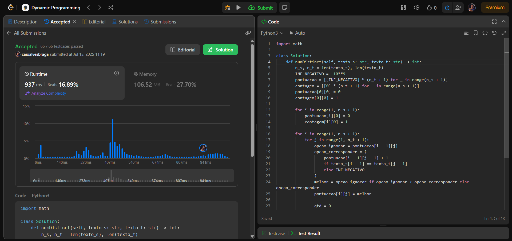
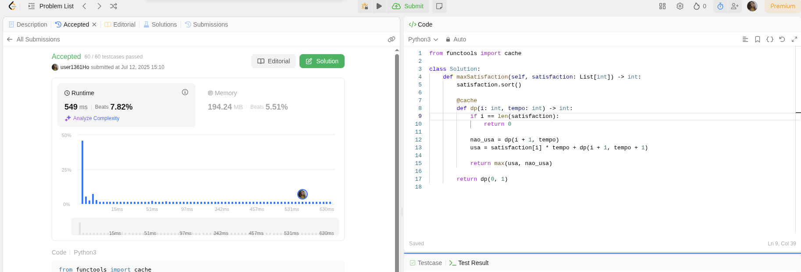
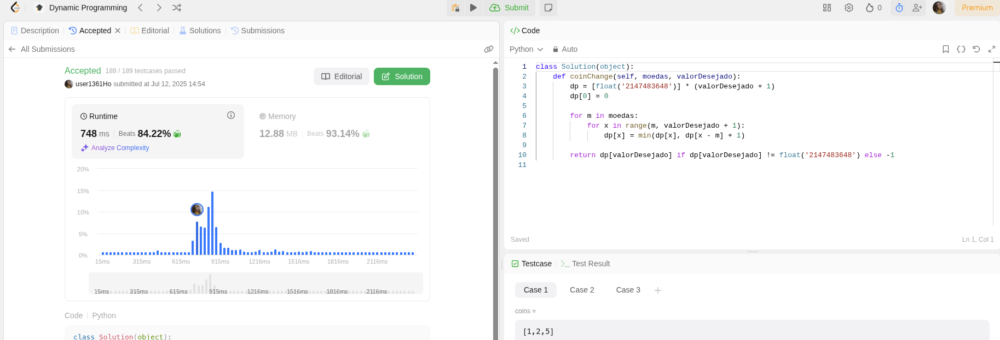

# **PD-LeetCode**

**Conteúdo da Disciplina**: Programação Dinâmica
https://youtu.be/M3L8qVzai04

## Alunos

| Matrícula  | Aluno                    |
| ---------- | ------------------------ |
| 211030694 | Caio Felipe Alves Braga |
| 211039617 | Maria Luisa Alves Rodrigues|

## Sobre

Este repositório agrupa as soluções em Python para problemas do LeetCode, todos resolvidos com abordagem de programação dinâmica. Os problemas contemplados aqui são:

* **115. Distinct Subsequences**
* **1402. Reducing Dishes**
* **322. Coin Change**

## Screenshots

### [115. Distinct Subsequences](https://leetcode.com/problems/distinct-subsequences/)




### [1402. Reducing Dishes](https://leetcode.com/problems/reducing-dishes/)




### [322. Coin Change](https://leetcode.com/problems/coin-change/)




## Instalação

**Linguagem**: Python 3

1. Clone este repositório e navegue até a pasta do problema desejado.

2. Execute a solução com:

   ```bash
   python3 solucao.py
   ```
